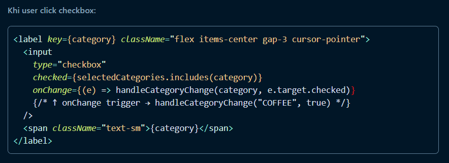
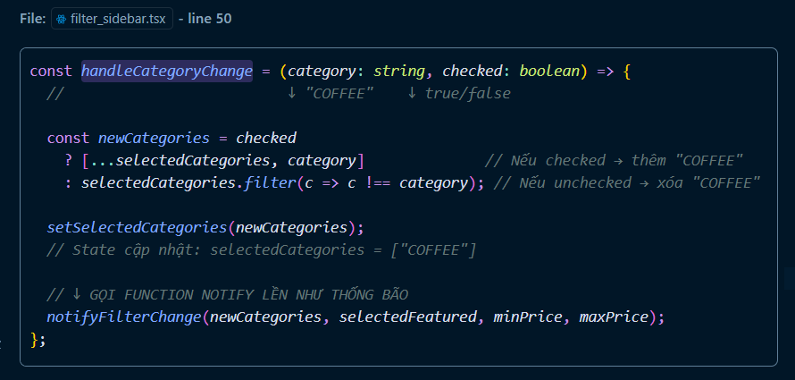
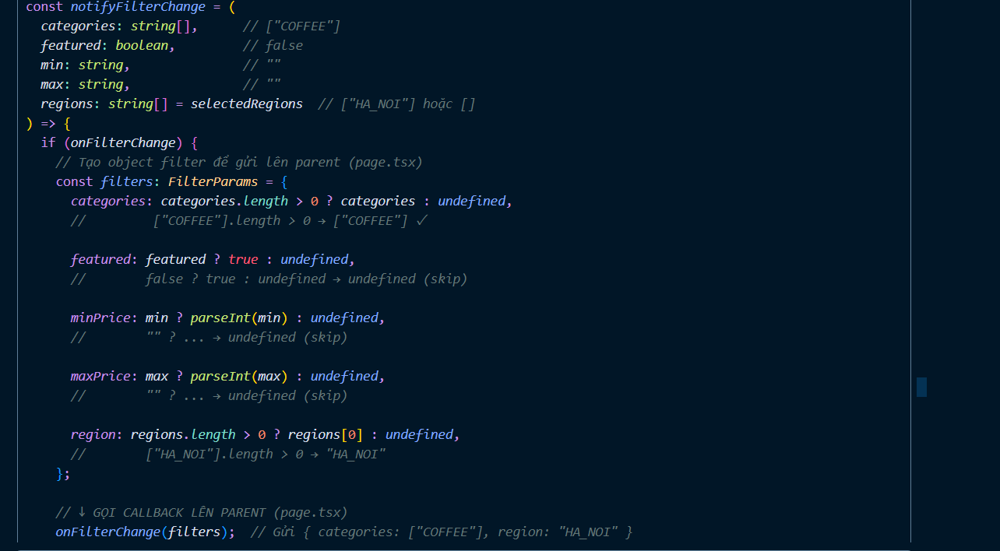
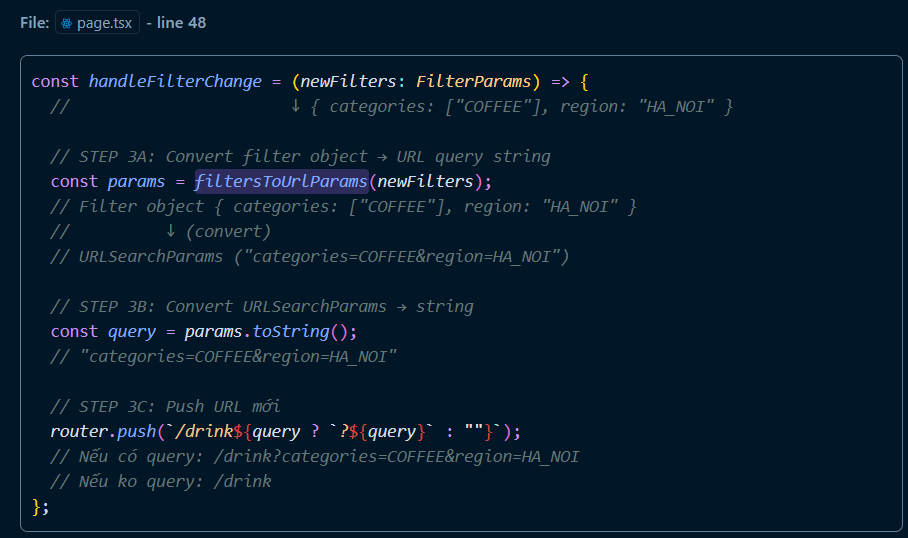
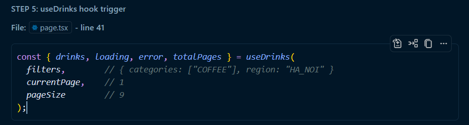
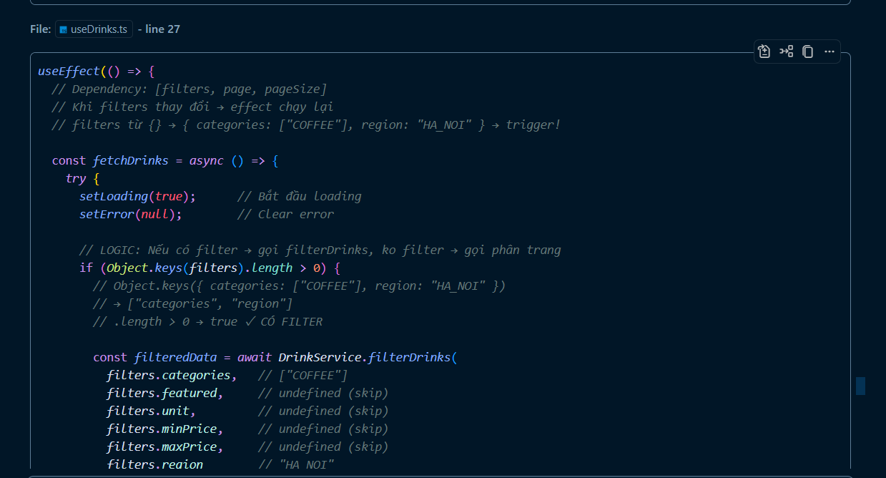
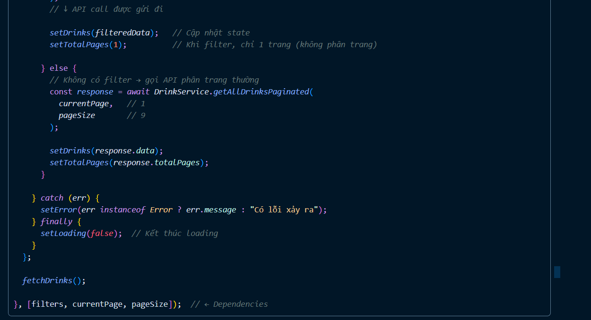
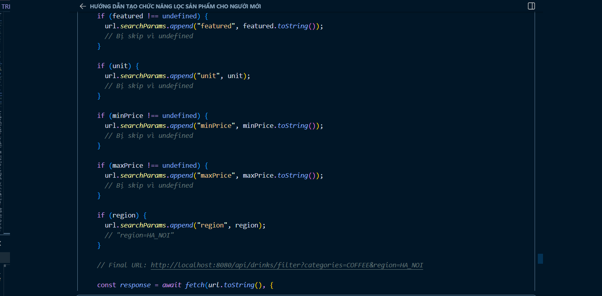
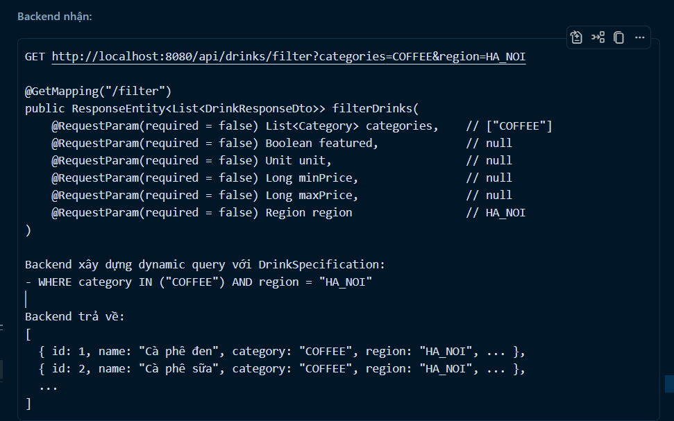

 XÂY DỰNG TÍNH NĂNG LỌC, TÌM KIẾM VÀ HIỂN THỊ SẢN PHẨM (Drink/Food/Fresh)
**Types → Services → Hooks → Components → Pages**
 Lọc (filter), Tìm kiếm (search), Region filter, Responsive sidebar, Tách component reusable


## 🔄 Quy trình xây dựng :

Bước 1: Định nghĩa TYPES (Kiểu dữ liệu)
   ↓
Bước 2: Tạo UTILITIES (Hàm tiện ích)
   ↓
Bước 3: Tạo SERVICES (Gọi API backend)
   ↓
Bước 4: Tạo HOOKS (Logic React)
   ↓
Bước 5: Tạo COMPONENTS (UI - giao diện)
   ↓
Bước 6: Tạo PAGES (Ghép tất cả lại)
```

**Lý do**: Vì file trên phải được tạo trước, những file dưới mới dùng được.
- Types → Utilities, Services dùng Types để định nghĩa kdl gửi đi cũng như nhận về cho phù hợp ví dụ nha khi mi gửi dlieu đi có gọi đến file này dùng interface Drink nếu m gửi đi nhầm category mà m gửi số là nó báo lỗi liên , và khi nhận dlieu từ backend nó nhận về có đủ các trường như là : id, name, description, price... thì nó chính là drink 
- Services dùng API endpoints từ Utilities
- Hooks dùng Services
- Components dùng Hooks
- Pages ghép tất cả Components lại

---

## 📁 Kiến trúc Folder

```
e-commerce-interface/
├── types/
│   └── drink.ts                 ← Định nghĩa Drink, FilterParams, ...
├── lib/
│   └── api.ts                   ← API_BASE_URL, ENDPOINTS
├── utils/
│   └── filter.ts                ← Parse URL ↔ Filter object
├── service/
│   ├── DrinkService.ts          ← Gọi API drinks
│   ├── FoodService.ts           ← Gọi API foods (sau)
│   └── FreshService.ts          ← Gọi API fresh (sau)
├── hooks/
│   ├── useDrinks.ts             ← Hook lấy drinks
│   ├── useFood.ts               ← Hook lấy food (sau)
│   ├── useFresh.ts              ← Hook lấy fresh (sau)
│   └── useSearch.ts             ← Hook tìm kiếm sản phẩm
├── app/
│   ├── components/
│   │   ├── header.tsx           ← Header với search bar
│   │   ├── footer.tsx           ← Footer
│   │   ├── drink_card.tsx       ← Card hiển thị 1 sản phẩm
│   │   ├── filter_sidebar.tsx   ← Sidebar lọc (Category, Price, Region)
│   │   ├── search_filter.tsx    ← Search popup
│   │   ├── results-display.tsx  ← Component reusable hiển thị kết quả
│   │   └── ui/
│   │       ├── button.tsx       ← Button component
│   │       └── input.tsx        ← Input component
│   ├── drink/
│   │   └── page.tsx             ← Trang Drink (Filter + Display)
│   ├── search/
│   │   └── page.tsx             ← Trang kết quả tìm kiếm
│   ├── food/ (sau)
│   │   └── page.tsx             ← Trang Food
│   ├── fresh/ (sau)
│   │   └── page.tsx             ← Trang Fresh
│   ├── layout.tsx
│   ├── page.tsx
│   └── ...
└── public/
    └── image/
        └── ...
```

## 📌 Thứ tự tạo file

| Thứ tự | File | Thư mục | Mục đích |
|--------|------|---------|---------|
| **1** | `drink.ts` | `types/` | Định nghĩa Drink, FilterParams, ... |
| **2** | `api.ts` | `lib/` | Định nghĩa API endpoints |
| **3** | `filter.ts` | `utils/` | Hàm convert filter ↔ URL |
| **4** | `DrinkService.ts` | `service/` | Gọi API /drinks endpoint |
| **5** | `useDrinks.ts` | `hooks/` | Hook lấy drinks data |
| **6** | `useSearch.ts` | `hooks/` | Hook tìm kiếm sản phẩm |
| **7** | `drink_card.tsx` | `app/components/` | Card hiển thị 1 sản phẩm |
| **8** | `filter_sidebar.tsx` | `app/components/` | Sidebar bộ lọc + region |
| **9** | `search_filter.tsx` | `app/components/` | Search bar ở header |
| **10** | `results-display.tsx` | `app/components/` | Component reusable hiển thị results |
| **11** | `page.tsx` | `app/drink/` | Trang Drink chính (Filter + Display) |
| **12** | `page.tsx` | `app/search/` | Trang kết quả tìm kiếm |

---

## 🔍 Chi tiết từng file

### 📌 FILE 1: `types/drink.ts` - Định nghĩa Kiểu dữ liệu

**Vị trí**: `types/drink.ts`

**Mục đích**: Định nghĩa cấu trúc dữ liệu của sản phẩm, giúp TypeScript hiểu được dữ liệu như thế nào.

```typescript
// ============================================================================
// 1️⃣ Kiểu DỮ LIỆU SẢN PHẨM ĐƠNGIẢN
// ============================================================================
export interface Drink {
  id: number              // ID sản phẩm (1, 2, 3...)
  name: string            // Tên sản phẩm ("Cà phê đen", "Trà sữa"...)
  description: string     // Mô tả chi tiết sản phẩm
  price: number           // Giá sản phẩm (50000, 80000...)
  quantity: number        // Số lượng tồn kho
  imageUrl: string        // Đường dẫn ảnh ("https://...")
  category: string        // Loại hàng ("COFFEE", "MILK_TEA"...)
  featured: boolean       // Có phải sản phẩm nổi bật không?
  unit: string            // Đơn vị ("ml", "ly"...)
  region: string          // Xuất xứ ("Việt Nam", "Brazil"...)
  createdAt?: string      // Ngày tạo (tuỳ chọn)
  updatedAt?: string      // Ngày chỉnh sửa (tuỳ chọn)
}

// ============================================================================
// 2️⃣ Kiểu DỮ LIỆU CHO COMPONENT (Kế thừa từ Drink)
// ============================================================================
export type DrinkCardProps = Drink;
// → Nghĩa: Component DrinkCard nhận dữ liệu giống như Drink

// ============================================================================
// 3️⃣ Kiểu DỮ LIỆU RESPONSE PHÂN TRANG
// ============================================================================
// Khi backend trả về dữ liệu có phân trang, nó gửi kèm theo thông tin này:
export interface PaginatedDrinkResponse {
  data: Drink[]           // Mảng sản phẩm của trang này
  pageNumber: number      // Trang hiện tại (1, 2, 3...)
  pageSize: number        // Số sản phẩm trên 1 trang (10, 20...)
  totalRecords: number    // Tổng số sản phẩm có trong database
  totalPages: number      // Tổng số trang (nếu có 100 sp, pageSize 10 → totalPages = 10)
  hasNext: boolean        // Có trang tiếp theo không?
  hasPrevious: boolean    // Có trang trước không?
}

// ============================================================================
// 4️⃣ Kiểu DỮ LIỆU BỘLỌC
// ============================================================================
// Người dùng chọn các tiêu chí lọc, ta lưu vào interface này
export interface FilterParams {
  categories?: string[]   // Danh sách loại hàng (ví dụ: ["COFFEE", "JUICE"])
  featured?: boolean      // Chỉ hiển thị sản phẩm nổi bật?
  minPrice?: number       // Giá tối thiểu
  maxPrice?: number       // Giá tối đa
  unit?: string           // Đơn vị
  region?: string         // Xuất xứ
}
// Ký hiệu ? nghĩa là tuỳ chọn, có thể không cần chọn
```

**Giải thích**:
- **Interface** là một "hợp đồng" mô tả cấu trúc dữ liệu
- Mỗi trường (field) có một **kiểu** (`string`, `number`, `boolean`)
- **?** nghĩa là tuỳ chọn (không bắt buộc)
- **Drink[]** nghĩa là "mảng các Drink"

---

### 📌 FILE 2: `lib/api.ts` - Định nghĩa API Endpoints

**Vị trí**: `lib/api.ts`

**Mục đích**: Centralize (tập trung) tất cả URL API vào một file, dễ bảo trì.

```typescript
// ============================================================================
// 1️⃣ BASE URL - ĐƯỜNG DẪN GỐC
// ============================================================================
export const API_BASE_URL =
  process.env.NEXT_PUBLIC_API_URL || "http://localhost:8080/api";

// Giải thích:
// - process.env.NEXT_PUBLIC_API_URL: Biến môi trường
//   + Ở local: "http://localhost:8080/api"
//   + Ở production: "https://api.example.com"
// - "||" (hoặc): Nếu không có biến env, dùng "http://localhost:8080/api"

// ============================================================================
// 2️⃣ CÁC ENDPOINT (ĐƯỜNG DẪN CỤ THỀ)
// ============================================================================
export const DRINK_ENDPOINTS = {
  GET_ALL_PAGINATED: "/drinks/paging",      // Lấy sản phẩm có phân trang
  GET_BY_ID: "/drinks",                     // Lấy 1 sản phẩm theo ID
  SEARCH: "/drinks/search",                 // Tìm kiếm
  FILTER: "/drinks/filter",                 // Lọc theo tiêu chí
  CREATE: "/drinks",                        // Thêm sản phẩm (admin)
  UPDATE: "/drinks",                        // Chỉnh sửa sản phẩm (admin)
  DELETE: "/drinks",                        // Xoá sản phẩm (admin)
} as const;

// ============================================================================
// VÍ DỤ SỬ DỤNG:
// ============================================================================
// URL đầy đủ khi lấy sản phẩm phân trang:
// BASE_URL + ENDPOINT + query
// http://localhost:8080/api/drinks/paging?page=1&size=10

// URL đầy đủ khi lấy chi tiết sản phẩm ID=5:
// http://localhost:8080/api/drinks/5
```

**Lợi ích**:
- Nếu backend đổi URL, bạn chỉ sửa 1 file này
- Dễ nhìn tất cả endpoint
- Tránh lỗi chính tả

---

### 📌 FILE 3: `utils/filter.ts` - Hàm Convert Filter ↔ URL

**Vị trí**: `utils/filter.ts`

**Mục đích**: là để tranh tình trạng xem chi tiết xong quay lại mất cái tick chọn ở sidebar phải chọn lại hoặc reload thì bị mất phải chọn lại. 

```typescript
// ============================================================================
// VÍ DỤ THỰC TẾ
// ============================================================================

// Nếu URL là:
// /drink?categories=COFFEE&categories=JUICE&minPrice=50000&maxPrice=100000
//
// → parseUrlParamsToFilters() trả về:
// {
//   categories: ["COFFEE", "JUICE"],
//   minPrice: 50000,
//   maxPrice: 100000
// }
//
// →useDrinks dùng filter object này để gọi API
//
// → Backend trả về sản phẩm matching
//
// → Hiển thị sản phẩm
//
// Người dùng thay đổi filter (ví dụ: bỏ JUICE)
//
// → filtersToUrlParams() chuyển thành:
// "categories=COFFEE&minPrice=50000&maxPrice=100000"
//
// → router.push("/drink?categories=COFFEE&minPrice=50000&maxPrice=100000")
//
// → URL change → useEffect trigger → gọi API lại
```


---

### 📌 FILE 4: `service/DrinkService.ts` - Gọi API Backend

**Vị trí**: `service/DrinkService.ts`

**Mục đích**: Tách riêng logic gọi API khỏi component, dễ bảo trì và test.

```typescript
import { API_BASE_URL, DRINK_ENDPOINTS } from "@/lib/api";
import type { Drink, PaginatedDrinkResponse } from "@/types/drink";

// ============================================================================
// DRINKSERVICE - TẤT CẢ CÁC HÀM GỌI API LIÊNquan ĐẾN SẢN PHẨM
// ============================================================================
export const DrinkService = {

  // ──────────────────────────────────────────────────────────────────────
  // 1️⃣ LẤY DANH SÁCH SẢN PHẨM CÓ PHÂN TRANG
  // ──────────────────────────────────────────────────────────────────────
  async getAllDrinksPaginated(
    page: number = 1,
    pageSize: number = 10
  ): Promise<PaginatedDrinkResponse> {
    try {
      // Tạo URL đầy đủ
      const url = new URL(`${API_BASE_URL}${DRINK_ENDPOINTS.GET_ALL_PAGINATED}`);
      // Ví dụ: URL = "http://localhost:8080/api/drinks/paging"
      
      // Thêm query params
      url.searchParams.append("page", page.toString());
      url.searchParams.append("size", pageSize.toString());
      // Ví dụ: URL = "http://localhost:8080/api/drinks/paging?page=1&size=10"

      // Fetch dữ liệu từ API
      const response = await fetch(url.toString(), {
        method: "GET",
        headers: {
          "Content-Type": "application/json",
        },
        cache: "no-store",  // Lúc nào cũng gọi API mới, ko dùng cache
      });

      // Kiểm tra có lỗi không
      if (!response.ok) {
        // response.ok = false nghĩa là có lỗi (status 400, 404, 500...)
        throw new Error(
          `Failed to fetch drinks: ${response.status} ${response.statusText}`
        );
      }

      // Parse JSON từ response
      const data: PaginatedDrinkResponse = await response.json();
      return data;
      
    } catch (error) {
      console.error("Error in DrinkService.getAllDrinksPaginated:", error);
      throw error;  // Throw lại để component handle
    }
  },

  // ──────────────────────────────────────────────────────────────────────
  // 2️⃣ LẤY CHI TIẾT 1 SẢN PHẨM THEO ID
  // ──────────────────────────────────────────────────────────────────────
  async getDrinkById(id: number): Promise<Drink> {
    try {
      // Tạo URL: /drinks/5 (với id = 5)
      const url = `${API_BASE_URL}${DRINK_ENDPOINTS.GET_BY_ID}/${id}`;
      
      const response = await fetch(url, {
        method: "GET",
        headers: {
          "Content-Type": "application/json",
        },
        cache: "no-store",
      });

      if (!response.ok) {
        throw new Error(
          `Failed to fetch drink: ${response.status} ${response.statusText}`
        );
      }

      const data: Drink = await response.json();
      return data;
      
    } catch (error) {
      console.error("Error in DrinkService.getDrinkById:", error);
      throw error;
    }
  },

  // ──────────────────────────────────────────────────────────────────────
  // 3️⃣ TÌM KIẾM NÂNG CAO
  // ──────────────────────────────────────────────────────────────────────
  async searchDrinks(
    name?: string,
    description?: string,
    category?: string,
    region?: string
  ): Promise<Drink[]> {
    try {
      const url = new URL(`${API_BASE_URL}${DRINK_ENDPOINTS.SEARCH}`);
      
      // Thêm params nếu có
      if (name) url.searchParams.append("name", name);
      if (description) url.searchParams.append("description", description);
      if (category) url.searchParams.append("category", category);
      if (region) url.searchParams.append("region", region);

      const response = await fetch(url.toString(), {
        method: "GET",
        headers: {
          "Content-Type": "application/json",
        },
        cache: "no-store",
      });

      if (!response.ok) {
        throw new Error(
          `Failed to search drinks: ${response.status} ${response.statusText}`
        );
      }

      const data: Drink[] = await response.json();
      return data;
      
    } catch (error) {
      console.error("Error in DrinkService.searchDrinks:", error);
      throw error;
    }
  },

  // ──────────────────────────────────────────────────────────────────────
  // 4️⃣ LỌC SẢN PHẨM THEO NHIỀU TIÊU CHÍ ⭐ MỨC ĐỘ LỌC CAO
  // ──────────────────────────────────────────────────────────────────────
  async filterDrinks(
    categories?: string[],      // Ví dụ: ["COFFEE", "JUICE"]
    featured?: boolean,         // Ví dụ: true
    unit?: string,              // Ví dụ: "ml"
    minPrice?: number,          // Ví dụ: 50000
    maxPrice?: number,          // Ví dụ: 100000
    region?: string             // Ví dụ: "Vietnam"
  ): Promise<Drink[]> {
    try {
      const url = new URL(`${API_BASE_URL}${DRINK_ENDPOINTS.FILTER}`);

      // CATEGORIES - có thể có nhiều
      if (categories && categories.length > 0) {
        categories.forEach((cat) =>
          url.searchParams.append("categories", cat)
        );
        // Ví dụ: ?categories=COFFEE&categories=JUICE
      }

      // FEATURED
      if (featured !== undefined) {
        url.searchParams.append("featured", featured.toString());
        // true → "true"
      }

      // UNIT
      if (unit) url.searchParams.append("unit", unit);

      // MIN PRICE
      if (minPrice !== undefined) 
        url.searchParams.append("minPrice", minPrice.toString());

      // MAX PRICE
      if (maxPrice !== undefined) 
        url.searchParams.append("maxPrice", maxPrice.toString());

      // REGION
      if (region) url.searchParams.append("region", region);

      // URL cuối cùng ví dụ:
      // /drinks/filter?categories=COFFEE&categories=JUICE&minPrice=50000&maxPrice=100000

      const response = await fetch(url.toString(), {
        method: "GET",
        headers: {
          "Content-Type": "application/json",
        },
        cache: "no-store",
      });

      if (!response.ok) {
        throw new Error(
          `Failed to filter drinks: ${response.status} ${response.statusText}`
        );
      }

      const data: Drink[] = await response.json();
      return data;
      
    } catch (error) {
      console.error("Error in DrinkService.filterDrinks:", error);
      throw error;
    }
  },
};

// ============================================================================
// CÁCH SỬ DỤNG (Từ component)
// ============================================================================

// 1️⃣ Lấy tất cả sản phẩm trang 1
// const data = await DrinkService.getAllDrinksPaginated(1, 10);

// 2️⃣ Lấy chi tiết sản phẩm ID=5
// const drink = await DrinkService.getDrinkById(5);

// 3️⃣ Tìm kiếm
// const results = await DrinkService.searchDrinks("cà phê");

// 4️⃣ Lọc phức tạp
// const filtered = await DrinkService.filterDrinks(
//   ["COFFEE", "JUICE"],    // categories
//   true,                    // featured
//   "ml",                    // unit
//   50000,                   // minPrice
//   100000,                  // maxPrice
//   "Vietnam"                // region
// );
```

**Tóm tắt**:
- Mỗi hàm gọi một endpoint khác nhau
- Có error handling (try-catch)
- Tách logic khỏi UI

---

### 📌 FILE 5: `hooks/useDrinks.ts` - Custom React Hook

**Vị trị**: `hooks/useDrinks.ts`

**Mục đích**: Quản lý state loading, error, data. Tự động gọi API khi filter change.

```typescript
"use client";
// "use client" vì đây là custom hook dùng useState, useEffect

import { useEffect, useState } from "react";
import { DrinkService } from "@/service/DrinkService";
import type { DrinkCardProps, FilterParams } from "@/types/drink";

// ============================================================================
// 1️⃣ ĐỊNH NGHĨA KIỂU DỮ LIỆU RETURN
// ============================================================================
interface UseDrinksResult {
  drinks: DrinkCardProps[];     // Mảng sản phẩm
  loading: boolean;              // Đang load?
  error: string | null;          // Có lỗi gì?
  totalPages: number;            // Tổng số trang
}

// ============================================================================
// 2️⃣ CUSTOM HOOK
// ============================================================================
export function useDrinks(
  filters: FilterParams,      // Input 1: Bộ lọc
  page: number,               // Input 2: Trang hiện tại
  pageSize: number            // Input 3: Số item/trang
): UseDrinksResult {
  // Return type: UseDrinksResult
  // Nghĩa: Hàm này trả về object có 4 field trên

  // ──────────────────────────────────────────────────────────────────────
  // KHAI BÁO STATE
  // ──────────────────────────────────────────────────────────────────────
  const [drinks, setDrinks] = useState<DrinkCardProps[]>([]);
  // drinks: []  (ban đầu là mảng rỗng)
  // setDrinks: Function để update drinks

  const [loading, setLoading] = useState(true);
  // loading: true  (lúc đầu đang load)
  // setLoading: Function để update loading

  const [error, setError] = useState<string | null>(null);
  // error: null  (ko có lỗi)
  // setError: Function để update error

  const [totalPages, setTotalPages] = useState(0);
  // totalPages: 0  (chưa biết)
  // setTotalPages: Function để update totalPages

  // ──────────────────────────────────────────────────────────────────────
  // EFFECT: GỌIAAPI KHI FILTER/PAGE THAY ĐỔI
  // ──────────────────────────────────────────────────────────────────────
  // useEffect(() => { ... }, [filters, page, pageSize])
  // Mỗi khi filters/page/pageSize thay đổi, effect này chạy
  
  useEffect(() => {
    const fetchDrinks = async () => {
      // async function để dùng await

      try {
        // ─────────────────────────────────────────────────────────
        // RESET STATE
        // ─────────────────────────────────────────────────────────
        setLoading(true);       // Bắt đầu load
        setError(null);         // Clear error

        // ─────────────────────────────────────────────────────────
        // CÓ FILTER? → Gọi API filter
        // KHÔNG FILTER? → Gọi API phân trang
        // ─────────────────────────────────────────────────────────
        
        if (Object.keys(filters).length > 0) {
          // Object.keys(filters): Lấy tất cả keys của filter
          // Ví dụ: { categories: [...], minPrice: 50000 }
          // → keys = ["categories", "minPrice"]
          // .length > 0: Có keys không?
          
          // CÓ FILTER → Gọi filterDrinks
          const filteredData = await DrinkService.filterDrinks(
            filters.categories,   // Rút ra từng field
            filters.featured,
            filters.unit,
            filters.minPrice,
            filters.maxPrice,
            filters.region
          );

          setDrinks(filteredData);
          setTotalPages(1);       // Khi lọc, ko phân trang → 1 trang
          
        } else {
          // KHÔNG FILTER → Gọi API phân trang thường
          const response = await DrinkService.getAllDrinksPaginated(
            page,
            pageSize
          );

          setDrinks(response.data);
          setTotalPages(response.totalPages);
        }

      } catch (err) {
        // Lỗi xảy ra
        const errorMessage =
          err instanceof Error
            ? err.message
            : "Có lỗi xảy ra khi tải dữ liệu";

        setError(errorMessage);
        // Hiển thị thông báo lỗi lên UI

      } finally {
        // Luôn luôn chạy (dù success hay fail)
        setLoading(false);      // Kết thúc load
      }
    };

    fetchDrinks();  // Gọi hàm
    
  }, [filters, page, pageSize]);
  // Dependencies: Khi nào thay đổi thì chạy lại effect

  // ──────────────────────────────────────────────────────────────────────
  // RETURN
  // ──────────────────────────────────────────────────────────────────────
  return {
    drinks,       // Mảng sản phẩm lấy được
    loading,      // Đang load?
    error,        // Lỗi gì?
    totalPages    // Tổng trang
  };
}

// ============================================================================
// CÁCH SỬ DỤNG (Từ component)
// ============================================================================

// const { drinks, loading, error, totalPages } = useDrinks(
//   filters,      // { categories: ["COFFEE"], minPrice: 50000 }
//   currentPage,  // 1
//   pageSize      // 10
// );

// if (loading) return <p>Đang tải...</p>;
// if (error) return <p>Lỗi: {error}</p>;
// 
// return drinks.map(drink => <DrinkCard {...drink} />);
```

**Lý do dùng Hook**:
- Quản lý state
- Tự động gọi API
- Tái sử dụng logic ở nhiều component

---

### 📌 FILE 6: `app/components/drink_card.tsx` - Component Card Sản Phẩm

**Vị trị**: `app/components/drink_card.tsx`

**Mục đích**: Hiển thị 1 sản phẩm dưới dạng card.

```typescript
"use client"

import Image from "next/image"      // Component Next.js để load ảnh
import { Heart } from "lucide-react" // Icon library
import { useState } from "react"
import Link from "next/link"        // Điều hướng không reload trang
import { useSearchParams } from "next/navigation"
import { DrinkCardProps } from "@/types/drink"

// ============================================================================
// COMPONENT DRINKCARD
// ============================================================================
export default function DrinkCard(props: DrinkCardProps) {
  // Props: Tất cả thông tin sản phẩm (name, price, imageUrl, ...)

  // ──────────────────────────────────────────────────────────────────────
  // STATE
  // ──────────────────────────────────────────────────────────────────────
  const [isFavorited, setIsFavorited] = useState(false);
  // isFavorited: Có được yêu thích không?
  // setIsFavorited: Update state

  const searchParams = useSearchParams();
  // Lấy query string từ URL
  // Ví dụ: ?categories=COFFEE&minPrice=50000
  // → Dùng để preserve filter khi click vào detail

  // ──────────────────────────────────────────────────────────────────────
  // RÚT RA PROPS CẦN DÙNG
  // ──────────────────────────────────────────────────────────────────────
  const { id, name, imageUrl, featured } = props;
  // Rút ra từ props để dùng ở JSX

  // ──────────────────────────────────────────────────────────────────────
  // BUILD URL CHI TIẾT
  // ──────────────────────────────────────────────────────────────────────
  const detailHref =
    `/drink/${id}${searchParams.toString() ? `?${searchParams.toString()}` : ""}`;
  
  // Ví dụ:
  // Nếu URL hiện tại: /drink?categories=COFFEE&minPrice=50000
  // → detailHref: /drink/5?categories=COFFEE&minPrice=50000
  // 
  // Nếu URL: /drink (ko có query)
  // → detailHref: /drink/5

  // ══════════════════════════════════════════════════════════════════════
  // RETURN (JSX)
  // ══════════════════════════════════════════════════════════════════════
  return (
    <Link href={detailHref}>
      {/* Link: Nhấn vào card → navigate tới detail page */}
      
      <div className="group relative bg-white rounded-2xl overflow-hidden shadow-md hover:shadow-xl transition-all duration-300 cursor-pointer h-full">
        {/* 
        className giải thích:
        - bg-white: Nền trắng
        - rounded-2xl: Bo góc
        - shadow-md: Bóng mờ vừa
        - hover:shadow-xl: Khi hover → bóng to hơn
        - transition-all: Smooth animation
        - cursor-pointer: Con trỏ thành bàn tay
        - h-full: Chiều cao full
        - group: Dùng để group css (child dùng group-hover:...)
        */}

        {/* ────────────────────────────────────────────────────────────── */}
        {/* PHẦN ẢNH */}
        {/* ────────────────────────────────────────────────────────────── */}
        <div className="relative w-full h-64 overflow-hidden bg-gray-100">
          <Image
            src={imageUrl}
            alt={name}
            fill                    // Fill parent container
            className="object-cover group-hover:scale-110 transition-transform duration-300"
            // object-cover: Ảnh cover hết box (crop nếu cần)
            // group-hover:scale-110: Khi hover card → ảnh phóng to 1.1x
          />

          {/* Sticker "Nổi bật" nếu có */}
          {featured && (
            <div className="absolute top-3 left-3 bg-red-500 text-white px-2.5 py-1.5 rounded-full text-xs font-bold">
              Nổi bật
            </div>
          )}
          {/* 
          Logic: Nếu featured === true → hiển thị sticker
          Vị trí: Góc trên trái (top-3 left-3)
          */}

          {/* Button "Yêu thích" */}
          <button
            onClick={(e) => {
              e.preventDefault();        // Ngăn click navigate
              e.stopPropagation();       // Ngăn event bubble
              setIsFavorited(!isFavorited);  // Toggle
            }}
            className="absolute top-3 right-3 bg-white rounded-full p-2 shadow-lg"
          >
            <Heart
              size={20}
              className={isFavorited ? "fill-red-500 text-red-500" : "text-gray-400"}
            />
            {/* 
            Nếu isFavorited === true → Icon đỏ
            Nếu === false → Icon xám
            */}
          </button>
        </div>

        {/* ────────────────────────────────────────────────────────────── */}
        {/* PHẦN THÔNG TIN - TÊN VÀ NÚT ORDER */}
        {/* ────────────────────────────────────────────────────────────── */}
        <div className="p-4 flex justify-between items-start">
          <h3 className="font-bold text-base line-clamp-2">{name}</h3>
          {/* 
          h3: Tiêu đề
          line-clamp-2: Tối đa 2 dòng, dòng thứ 3 thành dấu "..."
          Ví dụ:
          Nếu name = "Cà phê đen ngon lắc đây là một sản phẩm tuyệt vời"
          → Hiển thị: "Cà phê đen ngon lắc đây là một sản..."
          */}

          <button
            onClick={(e) => {
              e.preventDefault();      // Ngăn click navigate
              e.stopPropagation();
            }}
            className="bg-red-500 hover:bg-red-600 text-white font-bold py-2 px-4 rounded-lg text-sm"
          >
            Order
          </button>
        </div>

      </div>
    </Link>
  )
}

// ============================================================================
// TÓM TẮT FLOW
// ============================================================================
// 1️⃣ Nhận props {id, name, price, imageUrl, featured, ...}
// 2️⃣ Render card với ảnh, tên, nút order
// 3️⃣ Nút yêu thích → toggle state
// 4️⃣ Click card → navigate tới /drink/[id]
// 5️⃣ Query string preserve → nhớ filter cũ khi back từ detail
```

**Điểm quan trọng**:
- Giữ `searchParams` khi navigate → user quay lại là vẫn nhớ filter
- Click nút → ngăn navigate (e.preventDefault)
- Card là "dumb component" - chỉ nhận props, ko gọi API

---

### 📌 FILE 7: `app/components/filter_sidebar.tsx` - Component Bộ lọc

**Vị trí**: `app/components/filter_sidebar.tsx` (file đã có, giải thích logic chính)

**Mục đích**: Sidebar cho người dùng chọn tiêu chí lọc.

```typescript
'use client';

import { useState, useEffect } from 'react';
import { ChevronDown, X } from 'lucide-react';
import type { FilterParams } from "@/types/drink";
import { Button } from "@/app/components/ui/button";

interface FilterSidebarProps {
  onFilterChange?: (filters: FilterParams) => void;  // Callback khi filter thay đổi
  initialFilters?: FilterParams;                      // Bộ lọc ban đầu từ URL
}

// ============================================================================
// COMPONENT FILTERSIDEBAR
// ============================================================================
export function FilterSidebar({ onFilterChange, initialFilters }: FilterSidebarProps) {
  
  // ──────────────────────────────────────────────────────────────────────
  // STATE
  // ──────────────────────────────────────────────────────────────────────
  const [isOpen, setIsOpen] = useState(true);
  // isOpen: Sidebar có mở không? (true = mở, false = ẩn)

  const [expandedSections, setExpandedSections] = useState<string[]>(['category', 'featured']);
  // expandedSections: Danh sách section nào đang mở rộng
  // Ban đầu: ['category', 'featured'] mở
  // ['price'] x → price ẩn

  // FILTER STATE
  const [selectedCategories, setSelectedCategories] = useState<string[]>([]);
  const [selectedFeatured, setSelectedFeatured] = useState<boolean>(false);
  const [minPrice, setMinPrice] = useState<string>('');
  const [maxPrice, setMaxPrice] = useState<string>('');

  // ──────────────────────────────────────────────────────────────────────
  // EFFECT: INIT FILTER TỪ URL
  // ──────────────────────────────────────────────────────────────────────
  useEffect(() => {
    if (initialFilters) {
      // Nếu trang load lần đầu với URL có query
      // ?categories=COFFEE&minPrice=50000
      // → initialFilters = { categories: ["COFFEE"], minPrice: 50000 }

      setSelectedCategories(initialFilters.categories || []);
      setSelectedFeatured(initialFilters.featured || false);
      setMinPrice(initialFilters.minPrice ? initialFilters.minPrice.toString() : '');
      setMaxPrice(initialFilters.maxPrice ? initialFilters.maxPrice.toString() : '');
    }
  }, [initialFilters]);

  // ──────────────────────────────────────────────────────────────────────
  // HÀM: Toggle section mở/ẩn
  // ──────────────────────────────────────────────────────────────────────
  const toggleSection = (section: string) => {
    setExpandedSections(prev =>
      prev.includes(section) 
        ? prev.filter(s => s !== section)    // Nếu mở → ẩn
        : [...prev, section]                  // Nếu ẩn → mở
    );
  };

  // ──────────────────────────────────────────────────────────────────────
  // HÀM: Thay đổi category
  // ──────────────────────────────────────────────────────────────────────
  const handleCategoryChange = (category: string, checked: boolean) => {
    const newCategories = checked
      ? [...selectedCategories, category]              // Thêm vào
      : selectedCategories.filter(c => c !== category); // Xoá khỏi

    setSelectedCategories(newCategories);
    // Gọi hàm notify để update parent
    notifyFilterChange(newCategories, selectedFeatured, minPrice, maxPrice);
  };

  // ──────────────────────────────────────────────────────────────────────
  // HÀM: Thay đổi Featured
  // ──────────────────────────────────────────────────────────────────────
  const handleFeaturedChange = (checked: boolean) => {
    setSelectedFeatured(checked);
    notifyFilterChange(selectedCategories, checked, minPrice, maxPrice);
  };

  // ──────────────────────────────────────────────────────────────────────
  // HÀM: Thay đổi giá (Min/Max)
  // ──────────────────────────────────────────────────────────────────────
  const handlePriceChange = (type: 'min' | 'max', value: string) => {
    if (type === 'min') {
      setMinPrice(value);
      notifyFilterChange(selectedCategories, selectedFeatured, value, maxPrice);
    } else {
      setMaxPrice(value);
      notifyFilterChange(selectedCategories, selectedFeatured, minPrice, value);
    }
  };

  // ──────────────────────────────────────────────────────────────────────
  // HÀM: Thông báo filter thay đổi lên parent
  // ──────────────────────────────────────────────────────────────────────
  const notifyFilterChange = (
    categories: string[],
    featured: boolean,
    min: string,
    max: string
  ) => {
    if (onFilterChange) {
      const filters: FilterParams = {
        categories: categories.length > 0 ? categories : undefined,
        featured: featured ? true : undefined,           // Chỉ thêm nếu true
        minPrice: min ? parseInt(min) : undefined,
        maxPrice: max ? parseInt(max) : undefined,
      };

      onFilterChange(filters);  // Gọi callback lên parent (page.tsx)
    }
  };

  // ──────────────────────────────────────────────────────────────────────
  // HÀM: Clear tất cả filter
  // ──────────────────────────────────────────────────────────────────────
  const handleClearFilters = () => {
    setSelectedCategories([]);
    setSelectedFeatured(false);
    setMinPrice('');
    setMaxPrice('');

    if (onFilterChange) {
      onFilterChange({});  // Gửi filter rỗng lên parent
    }
  };

  // ══════════════════════════════════════════════════════════════════════
  // RETURN (JSX) - SIDEBAR
  // ══════════════════════════════════════════════════════════════════════

  return (
    <>
      {/* SIDEBAR CHÍNH */}
      <aside className={`...`}>
        
        {/* NÚT ĐÓNG SIDEBAR */}
        <button onClick={() => setIsOpen(!isOpen)} ...>
          <X size={24} ... />
        </button>

        <h2 className="font-bold text-lg mb-6">Bộ lọc</h2>

        {/* ══════════════════════════════════════════════════════════════ */}
        {/* SECTION 1: CATEGORY */}
        {/* ══════════════════════════════════════════════════════════════ */}
        <div className="mb-6 pb-6 border-b border-border">
          {/* HEADER - Click để mở/ẩn */}
          <button
            onClick={() => toggleSection('category')}
            className="flex items-center justify-between w-full font-semibold"
          >
            <span>Danh mục</span>
            <ChevronDown
              className={`w-5 h-5 transition-transform ${
                expandedSections.includes('category') ? 'rotate-180' : ''
              }`}
              {/* rotate-180: Quay mũi tên 180° khi expand */}
            />
          </button>

          {/* CONTENT - Checkbox categories */}
          {expandedSections.includes('category') && (
            <div className="mt-4 grid grid-cols-2 gap-3">
              {['COFFEE', 'MILK_TEA', 'JUICE', 'TEA'].map((category) => (
                <label key={category} className="flex items-center gap-2 cursor-pointer">
                  <input
                    type="checkbox"
                    checked={selectedCategories.includes(category)}
                    onChange={(e) => handleCategoryChange(category, e.target.checked)}
                  />
                  <span>{category}</span>
                </label>
              ))}
            </div>
          )}
        </div>

        {/* ══════════════════════════════════════════════════════════════ */}
        {/* SECTION 2: FEATURED */}
        {/* ══════════════════════════════════════════════════════════════ */}
        <div className="mb-6 pb-6 border-b border-border">
          <button
            onClick={() => toggleSection('featured')}
            className="flex items-center justify-between w-full font-semibold"
          >
            <span>Sản phẩm nổi bật</span>
            <ChevronDown className={...} />
          </button>

          {expandedSections.includes('featured') && (
            <label className="flex items-center gap-3 mt-4 cursor-pointer">
              <input
                type="checkbox"
                checked={selectedFeatured}
                onChange={(e) => handleFeaturedChange(e.target.checked)}
              />
              <span>Chỉ hiển thị nổi bật</span>
            </label>
          )}
        </div>

        {/* ══════════════════════════════════════════════════════════════ */}
        {/* SECTION 3: PRICE */}
        {/* ══════════════════════════════════════════════════════════════ */}
        <div className="mb-6">
          <button
            onClick={() => toggleSection('price')}
            className="flex items-center justify-between w-full font-semibold"
          >
            <span>Khoảng giá</span>
            <ChevronDown className={...} />
          </button>

          {expandedSections.includes('price') && (
            <div className="mt-4 flex gap-3">
              {/* INPUT MIN PRICE */}
              <input
                type="number"
                placeholder="Tối thiểu"
                value={minPrice}
                onChange={(e) => handlePriceChange('min', e.target.value)}
              />
              {/* INPUT MAX PRICE */}
              <input
                type="number"
                placeholder="Tối đa"
                value={maxPrice}
                onChange={(e) => handlePriceChange('max', e.target.value)}
              />
            </div>
          )}
        </div>

        {/* NÚT XÓA BỘ LỌC */}
        <Button
          variant="outline"
          onClick={handleClearFilters}
          className="w-full mt-6"
        >
          Xóa bộ lọc
        </Button>
      </aside>

      {/* NÚT MỞ SIDEBAR (Khi ẩn) */}
      {!isOpen && (
        <button
          onClick={() => setIsOpen(true)}
          className="fixed left-4 top-35 z-50 bg-white p-3 rounded-lg shadow-lg border"
        >
          ☰
        </button>
      )}
    </>
  );
}

// ============================================================================
// TÓM TẮT LOGIC
// ============================================================================
// 1️⃣ Người dùng chọn checkbox category → setState
// 2️⃣ notifyFilterChange gọi callback lên parent → page.tsx
// 3️⃣ page.tsx gọi router.push với query mới
// 4️⃣ URL thay đổi → useSearchParams() trigger → hook re-fetch
// 5️⃣ Dữ liệu mới → re-render
```

**Flow**:
1. User click checkbox
2. Component update state
3. Gọi `onFilterChange` callback lên parent
4. Parent (page.tsx) update URL
5. URL change → Hook fetch lại

---

### 📌 FILE 8: `app/drink/page.tsx` - Trang Chính

**Vị trị**: `app/drink/page.tsx`

**Mục đích**: Main page - ghép tất cả component + hook lại với nhau.

```typescript
"use client";

import { useState, useMemo } from "react";
import { useSearchParams, useRouter } from "next/navigation";

import { FilterSidebar } from "@/app/components/filter_sidebar";
import { Footer } from "@/app/components/footer";
import { Header } from "@/app/components/header";
import DrinkCard from "@/app/components/drink_card";

import { useDrinks } from "@/hooks/useDrinks";

import type { FilterParams } from "@/types/drink";

import {
  parseUrlParamsToFilters,
  filtersToUrlParams
} from "@/utils/filter";

const DEFAULT_PAGE = 1;
const DEFAULT_PAGE_SIZE = 10;

// ============================================================================
// MAIN PAGE COMPONENT
// ============================================================================
export default function FoodPage() {

  // ──────────────────────────────────────────────────────────────────────
  // 1️⃣ LẤY SEARCH PARAMS TỪ URL
  // ──────────────────────────────────────────────────────────────────────
  const searchParams = useSearchParams();
  // URL: /drink?categories=COFFEE&minPrice=50000
  // → searchParams = URLSearchParams { categories: ["COFFEE"], minPrice: ["50000"] }

  const router = useRouter();
  // Router để push URL mới

  // ──────────────────────────────────────────────────────────────────────
  // 2️⃣ PARSE URL PARAMS → FILTER OBJECT
  // ──────────────────────────────────────────────────────────────────────
  const filters: FilterParams = useMemo(() => 
    parseUrlParamsToFilters(searchParams), 
    [searchParams]
  );
  // useMemo: Không parse lại nếu searchParams ko thay đổi (optimization)
  // Kết quả: { categories: ["COFFEE"], minPrice: 50000 }

  // ──────────────────────────────────────────────────────────────────────
  // 3️⃣ STATE: TRANG HIỆN TẠI
  // ──────────────────────────────────────────────────────────────────────
  const [currentPage, setCurrentPage] = useState(DEFAULT_PAGE);
  // currentPage: 1 (trang đầu)

  const pageSize = DEFAULT_PAGE_SIZE;
  // pageSize: 10 (10 sản phẩm/trang)

  // ──────────────────────────────────────────────────────────────────────
  // 4️⃣ GỌI HOOK: useDrinks (LẤY DỮ LIỆU)
  // ──────────────────────────────────────────────────────────────────────
  const { drinks, loading, error, totalPages } = useDrinks(
    filters,        // Bộ lọc
    currentPage,    // Trang
    pageSize        // Số item/trang
  );

  // Nếu filters thay đổi → hook re-fetch tự động
  // Nếu currentPage thay đổi → hook re-fetch tự động

  // ──────────────────────────────────────────────────────────────────────
  // 5️⃣ HÀM: Xử lý filter thay đổi
  // ──────────────────────────────────────────────────────────────────────
  const handleFilterChange = (newFilters: FilterParams) => {
    // newFilters: Bộ lọc mới từ FilterSidebar
    // Ví dụ: { categories: ["COFFEE"], minPrice: 50000 }

    // Convert filter → query string
    const params = filtersToUrlParams(newFilters);
    // params = URLSearchParams ("categories=COFFEE&minPrice=50000")

    const query = params.toString();
    // query = "categories=COFFEE&minPrice=50000"

    // Push URL mới
    router.push(`/drink${query ? `?${query}` : ""}`);
    // Nếu có query: /drink?categories=COFFEE&minPrice=50000
    // Nếu ko query: /drink (xóa filter)

    // ✅ URL change → searchParams update → filters update → useDrinks re-fetch
  };

  // ══════════════════════════════════════════════════════════════════════
  // RETURN (JSX)
  // ══════════════════════════════════════════════════════════════════════

  return (
    <main className="bg-background min-h-screen">

      <Header />

      <div className="max-w-7xl mx-auto px-4 py-12 pt-22">

        {/* GRID: SIDEBAR + CONTENT */}
        <div className="grid grid-cols-1 lg:grid-cols-4 gap-6">
          {/* lg:grid-cols-4: Desktop có 4 cột (1 sidebar + 3 content) */}
          {/* grid-cols-1: Mobile có 1 cột */}

          {/* ════════════════════════════════════════════════════════════ */}
          {/* SIDEBAR - BỘ LỌC */}
          {/* ════════════════════════════════════════════════════════════ */}
          <FilterSidebar
            onFilterChange={handleFilterChange}
            // Callback: Khi user thay đổi filter
            initialFilters={filters}
            // Ban đầu pre-fill filter từ URL
          />

          {/* ════════════════════════════════════════════════════════════ */}
          {/* CONTENT - DANH SÁCH SẢN PHẨM */}
          {/* ════════════════════════════════════════════════════════════ */}
          <div className="lg:col-span-3">
            {/* lg:col-span-3: Desktop chiếm 3 cột */}

            {/* 📍 STATE: LOADING */}
            {loading && (
              <p>Loading...</p>
            )}

            {/* 📍 STATE: LỖI */}
            {error && (
              <p className="text-red-500">{error}</p>
            )}

            {/* 📍 STATE: SUCCESS */}
            {!loading && !error && (
              <>
                {/* GRID SẢN PHẨM */}
                <div className="grid grid-cols-1 sm:grid-cols-2 lg:grid-cols-3 gap-6">
                  {/* 
                  grid-cols-1: Mobile 1 cột
                  sm:grid-cols-2: Tablet 2 cột
                  lg:grid-cols-3: Desktop 3 cột
                  */}

                  {drinks.map((drink) => (
                    <DrinkCard key={drink.id} {...drink} />
                  ))}
                  {/* 
                  drinks: Mảng sản phẩm từ hook
                  map: Lặp qua để tạo component
                  key: Unique identifier (React cần)
                  {...drink}: Spread operator truyền tất cảkey-value vào props
                  Ví dụ: { id: 1, name: "Cà phê", price: 50000 }
                  → <DrinkCard id={1} name="Cà phê" price={50000} />
                  */}
                </div>

                {/* PAGINATION - CHỈ HIỂN THỊ KHI KO CÓ FILTER */}
                {Object.keys(filters).length === 0 && (
                  {/* Object.keys(filters): Lấy tất cả key của filter
                      Ví dụ: { categories: [...], minPrice: 50000 }
                      → keys = ["categories", "minPrice"]
                      .length === 0: Ko có key nào (filter rỗng)
                      → Chỉ show pagination khi filter rỗng
                      (vì filter return tất cả → chỉ 1 trang)
                  */}

                  <div className="mt-8 flex items-center justify-center gap-4">

                    {/* NÚT "TRƯỚC" */}
                    <button
                      onClick={() =>
                        setCurrentPage((prev) =>
                          Math.max(1, prev - 1)
                          // Math.max(1, prev - 1): Ko được nhỏ hơn 1
                          // prev - 1: Giảm 1 trang
                        )
                      }
                    >
                      ← Trước
                    </button>

                    {/* HIỂN THỊ TRANG */}
                    <span>
                      Trang {currentPage} / {totalPages}
                    </span>

                    {/* NÚT "SAU" */}
                    <button
                      onClick={() =>
                        setCurrentPage((prev) =>
                          Math.min(totalPages, prev + 1)
                          // Math.min(totalPages, prev + 1): Ko được lớn hơn totalPages
                          // prev + 1: Tăng 1 trang
                        )
                      }
                    >
                      Sau →
                    </button>

                  </div>

                )}

              </>
            )}

          </div>

        </div>

      </div>

      <Footer />

    </main>
  );
}

// ============================================================================
// TÓM TẮT FLOW TOÀN BỘ
// ============================================================================
// 1️⃣ Trang load → parseUrlParamsToFilters → Lấy filter từ URL
// 2️⃣ Gọi useDrinks hook với filter + currentPage
// 3️⃣ Hook gọi DrinkService.filterDrinks hoặc .getAllDrinksPaginated
// 4️⃣ Backend trả dữ liệu → Hook update state
// 5️⃣ Page re-render, hiển thị drinks + loading/error states
// 6️⃣ User chọn filter từ sidebar → handleFilterChange
// 7️⃣ Convert filter → query → router.push
// 8️⃣ URL change → searchParams update → filters update → Hook re-fetch
// 9️⃣ Lặp lại bước 4-5
// 🔟 User click button phân trang → currentPage update → Hook re-fetch
```

**Điểm khóa**:
- `useMemo` tối ưu hóa parse (không parse lại nếu URL không đổi)
- Pagination chỉ hiển thị khi **không có filter**
- Mỗi khi filter/page thay đổi, hook tự động fetch

---

## 🔌 Kết nối giữa các file

```
URL Query String
    ↓
page.tsx (lấy searchParams)
    ↓
filter.ts (parseUrlParamsToFilters)
    ↓
filters object
    ↓
useDrinks.ts (nhận filters)
    ↓
DrinkService.ts (gọi API)
    ↓
Backend API
    ↓
Response (Drink[] hoặc PaginatedDrinkResponse)
    ↓
useDrinks.ts (update state)
    ↓
page.tsx (render)
    ↓
DrinkCard.tsx (display)
    ↓
FilterSidebar.tsx (receive prop)
    ↓
User thay đổi filter
    ↓
handleFilterChange()
    ↓
filter.ts (filtersToUrlParams)
    ↓
router.push(URL mới)
    ↓
Quay lại step 1
```

## 🔌 Kết nối giữa các file

```
URL Query String
    ↓
page.tsx (lấy searchParams)
    ↓
filter.ts (parseUrlParamsToFilters)
    ↓
filters object
    ↓
useDrinks.ts (nhận filters)
    ↓
DrinkService.ts (gọi API)
    ↓
Backend API
    ↓
Response (Drink[] hoặc PaginatedDrinkResponse)
    ↓
useDrinks.ts (update state)
    ↓
page.tsx (render)
    ↓
ResultsDisplay.tsx (display 4 states: loading/error/no-results/grid)
    ↓
DrinkCard.tsx (display từng sản phẩm)
    ↓
FilterSidebar.tsx (receive prop initialFilters)
    ↓
User thay đổi filter/region
    ↓
handleFilterChange()
    ↓
filter.ts (filtersToUrlParams)
    ↓
router.push(URL mới)
    ↓
Quay lại step 1
```

---

## 🔍 Flow: TÌM KIẾM (Search)

```
SearchFilter component (header)
    ↓
User nhập "cà phê" + nhấn Enter
    ↓
router.push("/search?name=cà phê&region=HA_NOI")
    ↓
/search/page.tsx (trang results)
    ↓
useSearch hook (gọi DrinkService.searchDrinks)
    ↓
Backend API /drinks/search?name=...&region=...
    ↓
Nhận Drink[] (không phân trang)
    ↓
ResultsDisplay.tsx (hiển thị kết quả)
```

---

## 🔍 Flow: LỌC (Filter)

```
FilterSidebar component (/drink page)
    ↓
User click checkbox category + region + input price
    ↓
notifyFilterChange({ categories: [...], region: "HA_NOI", minPrice: 50000, ... })
    ↓
handleFilterChange (page.tsx)
    ↓
filtersToUrlParams() + router.push()
    ↓
URL: /drink?categories=COFFEE&region=HA_NOI&minPrice=50000&maxPrice=100000
    ↓
searchParams change → filters update
    ↓
useDrinks re-fetch với filterDrinks()
    ↓
Backend API /drinks/filter?categories=COFFEE&region=HA_NOI&minPrice=50000&maxPrice=100000
    ↓
Nhận sản phẩm matching (1 page, ko phân trang)
    ↓
ResultsDisplay.tsx (hiển thị, ko show pagination)
```

---

## 📱 Flow: RESPONSIVE SIDEBAR

```
FilterSidebar có state: isOpen (true/false)
    ↓
Sidebar mở (isOpen=true):
  - className: 'block w-64 opacity-100'
  - Chiếm 1 cột grid
  - Content page chiếm 3 cột (lg:col-span-3)
    ↓
User click nút X → setIsOpen(false)
    ↓
onIsOpenChange callback lên page.tsx
    ↓
setIsSidebarOpen(false)
    ↓
Content page className: 'lg:col-span-4' (chiếm đầy cả hàng)
    ↓
Sidebar hidden + products expand LEFT
```

---

## 📊 Flow: COMPONENT REUSABLE (ResultsDisplay)

```
ResultsDisplay Component nhận props:
  - loading: boolean
  - error: string | null
  - results: Drink[]
  - resultCount?: string (ví dụ: "Tìm thấy 5 kết quả")
  - showPagination?: boolean
  - onPreviousPage?: () => void
  - onNextPage?: () => void
  - currentPage?: number
  - totalPages?: number
    ↓
Dùng ở app/drink/page.tsx:
  <ResultsDisplay
    loading={loading}
    error={error}
    results={drinks}
    showPagination={true}
    onPreviousPage={() => setCurrentPage(prev => Math.max(1, prev - 1))}
    onNextPage={() => setCurrentPage(prev => Math.min(totalPages, prev + 1))}
    currentPage={currentPage}
    totalPages={totalPages}
  />
    ↓
Dùng ở app/search/page.tsx:
  <ResultsDisplay
    loading={loading}
    error={error}
    results={results}
    resultCount={results.length > 0 ? `Tìm thấy ${results.length} kết quả` : undefined}
    showPagination={false}  ← Search không cần pagination
  />
```

---

## 🎯 Tạo trang Food/Fresh

### Bước 1: Copy DrinkService → Tạo FoodService/FreshService

**File: `service/FoodService.ts`**
```typescript
import { API_BASE_URL, FOOD_ENDPOINTS } from "@/lib/api";  // ← Thay DRINK → FOOD
import type { Food, PaginatedFoodResponse } from "@/types/food";  // ← Tạo type Food

export const FoodService = {
  async getAllFoodsPaginated(page: number = 1, pageSize: number = 10): Promise<PaginatedFoodResponse> {
    // Giống DrinkService nhưng:
    // - Endpoint: /foods/paging (thay /drinks/paging)
    // - Type: Food[]
  },
  // ... các hàm khác
};
```

**Bước này:**
- Copy DrinkService.ts
- Thay tất cả "Drink" → "Food"
- Thay endpoint "/drinks" → "/foods"

### Bước 2: Copy useDrinks → Tạo useFood

**File: `hooks/useFood.ts`**
```typescript
import { FoodService } from "@/service/FoodService";  // ← Thay DrinkService
import type { Food, FilterParams as FoodFilterParams } from "@/types/food";

export function useFood(
  filters: FoodFilterParams,
  page: number,
  pageSize: number
) {
  // Giống useDrinks nhưng gọi FoodService.getAllFoodsPaginated()
  // và FoodService.filterFoods()
}
```

### Bước 3: Tạo app/food/page.tsx

**File: `app/food/page.tsx`**
```typescript
import { useFood } from "@/hooks/useFood";  // ← Thay useDrinks
import type { Food, FilterParams as FoodFilterParams } from "@/types/food";

export default function FoodPage() {
  const filters = useMemo(() => 
    parseUrlParamsToFilters(searchParams),  // ← Utility dùng chung
    [searchParams]
  );

  const { foods, loading, error, totalPages } = useFood(
    filters,
    currentPage,
    pageSize
  );

  return (
    <main>
      <Header />
      
      <div className="max-w-7xl mx-auto px-4 py-12 pt-22">
        <div className="mb-12">
          <div className="flex items-center gap-3 mb-4">
            <span className="text-5xl">🍔</span>  {/* ← Thay icon */}
            <h1 className="text-4xl font-bold">Food</h1>
          </div>
          <p className="text-gray-600 text-lg">Khám phá những món ăn ngon lành</p>
        </div>

        <div className="grid grid-cols-1 lg:grid-cols-4 gap-6">
          <FilterSidebar
            onFilterChange={handleFilterChange}
            initialFilters={filters}
            onIsOpenChange={setIsSidebarOpen}
          />

          <div className={isSidebarOpen ? "lg:col-span-3" : "lg:col-span-4"}>
            <ResultsDisplay  {/* ← Dùng component chung */}
              loading={loading}
              error={error}
              results={foods}
              showPagination={Object.keys(filters).length === 0}
              onPreviousPage={() => setCurrentPage(prev => Math.max(1, prev - 1))}
              onNextPage={() => setCurrentPage(prev => Math.min(totalPages, prev + 1))}
              currentPage={currentPage}
              totalPages={totalPages}
            />
          </div>
        </div>
      </div>

      <Footer />
    </main>
  );
}
```

---

## 🎨 KEY POINTS (Các điểm quan trọng)

### 1. Tách Services
- Mỗi "category" (Drink, Food, Fresh) có service riêng
- Cực kỳ dễ bảo trì
- Dễ thay đổi endpoint

### 2. Tách Hooks
- Logic lấy dữ liệu ở hook
- Component chỉ render
- Reuse logic ở nhiều component

### 3. Component Reusable
- `ResultsDisplay`: Dùng cho Drink/Food/Fresh/Search
- `DrinkCard`: Dùng cho Drink card (sau tạo FoodCard, FreshCard)
- `FilterSidebar`: Dùng chung cho tất cả trang
- `SearchFilter`: Header search chung

### 4. URL State Management
- Filter lưu ở URL (query params)
- Easy to share: gửi link với filter → bạn bè vẫn thấy kết quả
- Browser back/forward hoạt động

### 5. Region Filter
- Thêm region dropdown vào FilterSidebar
- REGIONS array: ['HA_NOI', 'HO_CHI_MINH', 'DA_NANG', ...]
- Convert region → URL param → API param

### 6. Responsive Sidebar
- Sidebar state: `isOpen` (true/false)
- isOpen=true: sidebar visible, content lg:col-span-3
- isOpen=false: sidebar hidden, content lg:col-span-4 (expand)
- Callback `onIsOpenChange` để notify parent page

---

## 📚 VÍ DỤ THỰC TẾ

### Tình huống 1: User mở /drink lần đầu

```
1. URL: /drink
2. searchParams rỗng {}
3. filters = parseUrlParamsToFilters(searchParams) = {}
4. useDrinks nhận filters={}, page=1, pageSize=10
5. useDrinks detect filters rỗng → gọi getAllDrinksPaginated(1, 10)
6. API: GET http://localhost:8080/api/drinks/paging?page=1&size=10
7. Backend trả { data: [...10 sản phẩm], totalPages: 10, hasNext: true, ... }
8. useDrinks setState { drinks: [...], loading: false, totalPages: 10 }
9. Page render ResultsDisplay
10. ResultsDisplay hiển thị:
    - 10 cards trong grid (3 cột)
    - Pagination buttons (Trước/Sau)
    - "Trang 1 / 10"
11. User nhấn "Sau" → setCurrentPage(2)
12. Quay lại bước 4 với page=2
```

### Tình huống 2: User lọc "COFFEE" + region "HA_NOI" + giá 50k-100k

```
1. User ở /drink?... (bất kỳ)
2. User mở FilterSidebar (mặc định mở)
3. User check checkbox "COFFEE" ✓
4. FilterSidebar gọi notifyFilterChange({ categories: ["COFFEE"] })
5. Callback lên page.tsx → handleFilterChange({ categories: ["COFFEE"] })
6. filtersToUrlParams({ categories: ["COFFEE"] }) 
   → "categories=COFFEE"
7. router.push("/drink?categories=COFFEE")
8. URL thay đổi → searchParams update
9. filters = { categories: ["COFFEE"] }
10. useDrinks re-run với filters != {}
11. useDrinks gọi filterDrinks(["COFFEE"], undefined, undefined, undefined, undefined, undefined)
12. API: GET /drinks/filter?categories=COFFEE
13. Backend trả Drink[] (không phân trang, tất cả matching)
14. Render kết quả
15. User mở phần "Khoảng giá" → nhập 50000 min, 100000 max
16. Lặp lại bước 4-14 nhưng gọi tiếp 
    filterDrinks(["COFFEE"], undefined, undefined, 50000, 100000, undefined)
17. API: GET /drinks/filter?categories=COFFEE&minPrice=50000&maxPrice=100000
18. User mở phần "Khu vực" → click HA_NOI
19. Lặp lại bước 4-14
20. API: GET /drinks/filter?categories=COFFEE&minPrice=50000&maxPrice=100000&region=HA_NOI
21. Render sản phẩm matching cả 3 tiêu chí
22. Không hiển thị pagination (vì đang lọc)
```

### Tình huống 3: User tìm kiếm "cà phê"

```
1. User ở /drink hoặc bất kỳ page nào
2. User click icon search ở header → SearchFilter popup mở
3. User nhập "cà phê" vào input
4. User nhấn Enter hoặc click icon 🔍
5. handleSearch() gọi router.push("/search?name=cà phê")
6. Chuyển sang trang /search
7. SearchPage lấy name="cà phê" từ searchParams
8. useSearch hook nhận name="cà phê", description=undefined, category=undefined, region=undefined
9. useSearch gọi DrinkService.searchDrinks("cà phê", undefined, undefined, undefined)
10. API: GET /drinks/search?name=cà phê
11. Backend trả Drink[] (tất cả sản phẩm có tên chứa "cà phê")
12. ResultsDisplay render:
    - Loading spinner lúc fetch
    - Error message nếu có lỗi
    - "Không tìm thấy kết quả" nếu results rỗng
    - Grid sản phẩm nếu có
    - Không hiển thị pagination (search API không support phân trang)
13. Hiển thị query params ở đầu trang (name: "cà phê")
14. User click card → navigate tới /drink/5?name=cà phê (preserve search params)
15. Quay lại trang search → vẫn thấy kết quả cũ
```

### Tình huống 4: User xóa bộ lọc

```
1. User ở /drink?categories=COFFEE&minPrice=50000&maxPrice=100000&region=HA_NOI
2. User click nút "Xóa bộ lọc" ở FilterSidebar
3. FilterSidebar gọi handleClearFilters()
4. Reset tất cả state: selectedCategories=[], selectedFeatured=false, minPrice="", maxPrice="", selectedRegions=[]
5. notifyFilterChange([], false, "", "", [])
6. handleFilterChange() nhận {}
7. filtersToUrlParams({}) → ""
8. router.push("/drink")
9. URL thay đổi → /drink
10. searchParams rỗng → filters = {}
11. useDrinks re-run với filters={}
12. Gọi getAllDrinksPaginated(1, 10)
13. Quay lại tình huống 1
```

### Tình huống 5: User đóng/mở FilterSidebar (mobile)

```
1. FilterSidebar mặc định isOpen=true
2. User click nút X (đóng)
3. setIsOpen(false)
4. onIsOpenChange callback lên page.tsx → setIsSidebarOpen(false)
5. Sidebar className thay đổi:
   - isOpen=true: "block w-64 opacity-100"
   - isOpen=false: "hidden"
6. Content className thay đổi:
   - isSidebarOpen=true: "lg:col-span-3"
   - isSidebarOpen=false: "lg:col-span-4"
7. Sidebar ẩn, Products grid mở rộng sang trái
8. User click icon ☰ (nút hamburger lúc sidebar ẩn)
9. setIsOpen(true)
10. Sidebar reappear, Products squeeze lại (col-span-3)
```

### Tình huống 6: Tạo trang Food (sau khi hiểu Drink)

```
1. Copy DrinkService → FoodService
   - Thay export const DrinkService → FoodService
   - Thay DRINK_ENDPOINTS → FOOD_ENDPOINTS
   - Thay type Drink → Food
   - Thay /drinks → /foods
   
2. Copy useDrinks → useFood
   - Thay import DrinkService → FoodService
   - Thay type Drink → Food
   - Thay gọi DrinkService.* → FoodService.*
   
3. Copy app/drink/page.tsx → app/food/page.tsx
   - Thay import useDrinks → useFood
   - Thay type Drink → Food
   - Thay icon từ 🥤 → 🍔
   - Thay title "Drink" → "Food"
   - Thay description
   - Thay URL /drink → /food
   
4. DrinkCard, FilterSidebar, ResultsDisplay, SearchFilter dùng chung
   (không cần copy, dùng thẳng)
   
5. Test /food → hoạt động giống /drink
```

---

## ✅ CHECKLIST KHI TRIỂN KHAI

### Cho mỗi category (Drink, Food, Fresh):

- [ ] **types/drink.ts** - Định nghĩa Drink, FilterParams, PaginatedDrinkResponse
- [ ] **lib/api.ts** - Thêm DRINK_ENDPOINTS
- [ ] **service/DrinkService.ts** - Implement getAllDrinksPaginated, getDrinkById, searchDrinks, filterDrinks
- [ ] **hooks/useDrinks.ts** - Implement logic fetch data
- [ ] **app/drink/page.tsx** - Trang chính ghép tất cả

### Shared Components (dùng chung):

- [ ] **app/components/drink_card.tsx** - Card sản phẩm
- [ ] **app/components/filter_sidebar.tsx** - Bộ lọc (support categories, featured, price, region)
- [ ] **app/components/search_filter.tsx** - Search bar ở header
- [ ] **app/components/results-display.tsx** - Display kết quả (4 states)

### Search:

- [ ] **hooks/useSearch.ts** - Hook tìm kiếm
- [ ] **app/search/page.tsx** - Trang kết quả

---

## 🎯 QUICK START

### 1. Tạo type mới (nếu cần Food/Fresh)

```typescript
// types/drink.ts (đã có)
export interface Drink { ... }
export interface FilterParams { ... }

// Nếu muốn Food:
// types/food.ts
export interface Food extends Omit<Drink, 'category'> {
  // Tương tự Drink nhưng có thể customize
}
```

### 2. Tạo service mới

```typescript
// service/FoodService.ts (copy từ DrinkService)
// Thay DRINK → FOOD, /drinks → /foods
```

### 3. Tạo hook mới

```typescript
// hooks/useFood.ts (copy từ useDrinks)
// Thay useDrinks → useFood, DrinkService → FoodService
```

### 4. Tạo page mới

```typescript
// app/food/page.tsx (copy từ app/drink/page.tsx)
// Thay useDrinks → useFood
// Thay icon/title/description theo ý thích
```

### 5. Test

```bash
npm run dev

# Vào http://localhost:3000/drink
# Thử lọc, tìm kiếm, phân trang

# Copy page → /food
# Vào http://localhost:3000/food
# Thử lọc, tìm kiếm, phân trang
```

---

## 💡 TIPS & TRICKS

### Tip 1: Debug Filter
```typescript
// Thêm vào page.tsx để thấy filter hiện tại:
console.log("Current filters:", filters);
console.log("Current URL:", window.location.href);
```

### Tip 2: Mock Data (nếu API chưa ready)
```typescript
// DrinkService.ts
async filterDrinks(...): Promise<Drink[]> {
  // Thay vì gọi API:
  return [
    { id: 1, name: "Cà phê đen", category: "COFFEE", ... },
    { id: 2, name: "Trà sữa", category: "MILK_TEA", ... },
    // ...
  ];
}
```

### Tip 3: Optimize với useMemo
```typescript
// page.tsx
const filters = useMemo(
  () => parseUrlParamsToFilters(searchParams),
  [searchParams]
);  // Không parse lại nếu searchParams không đổi
```

### Tip 4: Clear Cache
```typescript
// Nếu cacheable query:
cache: "no-store"  // Luôn gọi API mới
// Hoặc:
cache: "revalidate" // Revalidate định kỳ
```

---

cách thức filter hoạt động như sau :
khu user click vào filter sidebar ví dụ click vào coffee và region ở hà nội còn mấy cái kia ko tíck thì nó có hàm onChange ở chỗ cái nút sẽ hoạt động : trong onchange có gọi đến  cái hàm handleCategoryChange  sẽ hdong nó sẽ sét lại category là coffee còn mấy cái kia nó để undefined , nó sẽ thêm categori : coffee và region ha_noi và newCategories sau đó gọi đến setSelectedCategories để state cập nhật lại  sau đó nó sẽ gọi đến hàm notifyFilterChange để thông báo rằng là à có đứa mới chọn kìa :  

- tiếp tục cái hàm notifyFilterChange sẽ cập nhật lại categories là COFFEE và region là ha_noi còn mấy cái kia kệ không chọn thì thôi thấy có thay đổi thì sẽ tạo object filter gửi lên file cha page.tsx với nhưng tiêu chí họ chọn để cbi hiển thị spham : 
filter object gửi lên có dạng : 
{
  categories: ["COFFEE"],
  featured: undefined,
  minPrice: undefined,
  maxPrice: undefined,
  region: "HA_NOI"
}

- ở file page.tsx nhận callback gửi lên ( dòng 48) : dòng này có nhiệm vụ là đọc cái filter object mà người dùng chọn xong được file kia gửi lên chuyển nó từ object {} thành chuỗi string sau đó gọi hàm filtersToUrlParams ở file filter.ts chuyển nó thành url . 

- xem file filter.ts nhé 

- sau khi chuyển file thì ở file filter.ts trả về return filters , thì dòng số 41 ở file page.tsx sau khi có nhưng thông tin mà filter đã chọn bắt dầu cho quá trình cbi gọi api trong file useDrinks ,với nhưng thông tin đó nó sẽ gọi đến file useDrinks với ttin /api/drinks/filter?categories=COFFEE&region=HA_NOI , nó sẽ hiển thi với trang 1 và 9 sản phẩm như đã định nghĩa ở trên trang page.tsx   

- ở file useDrink.ts có hàm useEffect ( tức là khi filter ở filter_sidbar được người dùng tthayddooi thì chạy lại "setloading" "clear lỗi" và fetch lại api với nhưng cái mà người dùng chọn )  có filter là khi nàolaf khi ngươid dùng chọn nó có dạng : Object.keys(filters) = ["categories","region"]
length = 2  tức là có filter . 
còn nếu ko có filter tức là người dùng ko chọn thì gọi gettall và có phân trang 
  

          setDrinks(filteredData);   // nếu call api thì dlieu trả về (filteredData) sẽ được lưu vào setDrinks 
          setTotalPages(1);  // vì dlieu trả vè ở backend ko làm phân trang nên nên nó để là 1 tức là tất cả sản phẩm sau khi filter sẽ được trả về 1 page duy nhất.

- file service.ts nó sẽ ccallapi và nhận về data ở đây link call api sẽ ở từ url mà file filter làm ra :
/api/drinks/filter?categories=COFFEE&region=HA_NOI

các tham số :
categories?: string[]
featured?: boolean
unit?: string
minPrice?: number
maxPrice?: number
region?: string 
sẽ đến từ file filter làm ra và gán vào lúc này sẽ có :
Category = COFFEE
Region = HA_NOI

nó sẽ gọi api với các tiêu chí trên : 

sau khi có dc data gửi về thì cạap nhật lại trạng thái đang loading về false ,lỗi error về null, và gửi data đó đến trang ResultsDisplay 

- ở trang ResultsDisplay nó sẽ nhận thông tin được gửi llên laf loading false là ko xoay nữa, ko có lỗi , và data :
data lúc này đang có dạng :
results = [
 { id:1, name:"Coffee" },
 { id:2, name:"Latte" }
]

lúc này nó sẽ dùng map để map qua tưng data sau đó tạo ra một drincard:
Ví dụ:

<DrinkCard id={1} name="Coffee" />
<DrinkCard id={2} name="Latte" />
sau đó dô làm UI cho drinkcard là mấy cái drinkcard kia có ui như nhau :
